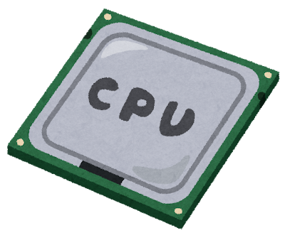
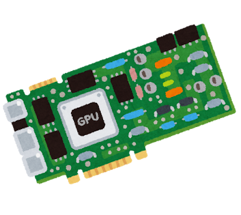
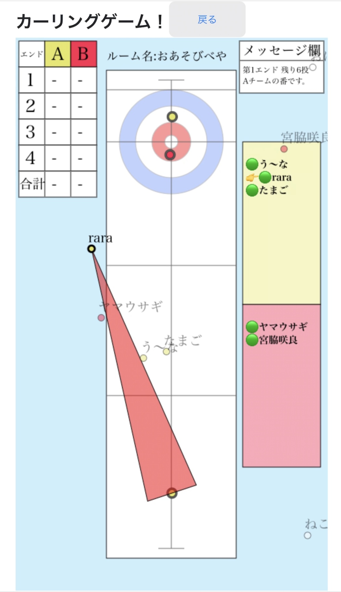
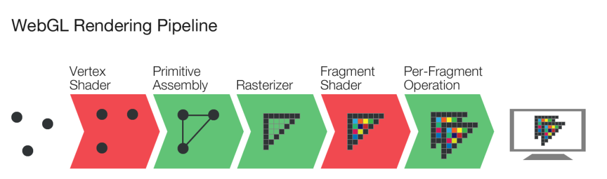

# WebGL2でGPGPUをしよう
発表者: 能津勇希

---
# 自己紹介
- 名前: 能津勇希（のづ ゆうき）
- 6月入社でそろそろLinkersは3ヶ月
- ゲーム好き

---

# GPGPUって？
## **G**eneral-**P**urpose computing on **G**raphics **P**rocessing **U**nits

---

# GPGPUって？
## **G**eneral-**P**urpose computing on **G**raphics **P**rocessing **U**nits
### つまりどういうことだってばよ


---

# GPGPUって？
## **G**eneral-**P**urpose computing on **G**raphics **P**rocessing **U**nits
#### **CPU**がやっているような汎用計算を**GPU**上で行うアプローチのこと。　並列計算の高速化がメリット。近年だとAIの事前学習や仮想通貨のマイニングなどで盛んに


---

# 背景
javaScriptメインでブラウザから気軽にプレイできるゲームをつくりたい
↓
作った 
↓
HTMLのCanvas要素（2dコンテキスト）流石に重すぎる
↓
WebGLを見つける
↓
ライブラリのthree.jsを触る
↓
これはWebGLちゃんと理解してないと使いこなせなさそう・・・

---

# 背景2
そういえばGPUで描画以外の計算もできるらしい（GPGPU）
↓
WebGLとGPUの動きをよく知るために、WebGLを使ってGPGPUをやってみよう！

---

# そもそものお話

- ## GPUとCPUってなにがどう違ってどうすごいの？
    - 一番はコアの数が違う
    - CPU:1~数十　GPU:数千
---
- ## じゃあGPUって最強？
    - 単純な計算の並列処理において最強
        - 数千個の頂点`vec3（x,y,z)`に対して座標変換等の計算をほぼ同時に行える
        - 数千の同じ仕事をするコアにデータを割り振って処理をするイメージ
        - cpuだとシングルプロセッサでforで回すような処理を一括でできる
    - 条件分岐やランダムアクセスは苦手
        - 条件分岐の多い仕事は、CPUなどは先んじて両方の結果を実行しておく仕組みなどがあるが、GPUにはない
        - データが互いに干渉するような（共通のメモリ領域に対してアクセスが必要）計算は苦手。大量の独立したデータを同じ処理で高速に捌くのがGPUの役目

---

# GPUでデータが処理される流れをイメージしよう
WebGLだろうがWebGPUだろうが、データを用意してそれをGPUが画面に出すまでの流れは変わらない。ゲームを題材にこれを先にイメージしよう

1. ### データの用意
    近年では分業が進み、**データ**と**変換行列**の用意は**CPU**の役目になっている。**オブジェクト**の当たり判定や**プレイヤー**の現在地を処理して、GPUが描画するのに必要なデータを用意する
2. ### データをGPUのバッファに送る
    1で用意したデータはPCのRAM上にある。これをGPUのapiを使って、GPUのバッファに送ってあげる
3. ### 描画指示を出して、GPUが描画を行う
    GPUはバッファのデータをもとに座標変換や頂点色の計算を行い画面に描画する

---

# GPUは何をしているのか
先ほどの3.で記述した、GPUが描画を行う　の部分だが、ここではGPUの描画パイプラインを紹介する

WebGL Rendering Pipeline 画像 古都こと様 WebGL2入門 基礎編
https://sbfl.net/blog/2016/09/04/webgl2-tutorial-basics/ より引用

この画像で一番左の部分がCPUで用意した頂点座標となる。これがまず頂点シェーダ(VertexShader)に渡され、座標変換処理が行われる。

---
### ところでシェーダーってなんだ
シェーダーとは、一つのスレッドがどのようにデータを処理するかを記述したもの。
下記のようにプログラマが内容を決定できるものをプログマブルシェーダと呼ぶ（昔は固定機能でGPU自体に組み込まれるものだったが、今はすべてプログマブルシェーダとなっている）
```glsl
in vec3 position;
out vec4 vColor;
// 処理の内容をmain()に記載
void main() {
    vColor = color; // 後述のフラグメントシェーダに渡される
    gl_Position = projection * view * model * vec4(position, 1.0);
    //            変換行列      変換行列 変換行列      バッファから取った頂点座標
}
```
上記の内容ではcolorをいじらずに渡しているが、例えば
`vColor = vec4 (1,1,1,position.y)`などと書いてあげれば、頂点の高さ方向によって透明度が変化するような処理ができる

---
## GPUは何をしているのか

WebGL Rendering Pipeline 画像 古都こと様 WebGL2入門 基礎編
https://sbfl.net/blog/2016/09/04/webgl2-tutorial-basics/ より引用

図に戻って、頂点シェーダで処理された内容はパイプラインを流れ、フラグメントシェーダーに渡される。ここでは頂点シェーダから渡された頂点色情報`vColor`やテクスチャをもとに、ピクセル単位での色付け作業が行われる。

---
## GPUは何をしているのか
フラグメントシェーダーのサンプルは以下のようなイメージ。ここでは受け取った色をそのまま後続に渡しているだけなので非常にシンプル
```glsl
in vec4 vColor; //vertexShaderから受け取ったvColor
out vec4 fragmentColor;

void main(void){
    // 
    fragmentColor = vColor;
}
```

---

# WebGLって何者？
canvas要素のwebGLコンテキストを通して、js実行環境とGPUとのやりとりを可能とさせてくれる、橋渡しのような存在。上記で紹介したような、シェーダーの作成、バッファの作成とバッファへのデータの送信、描画命令など一連の流れをjavaScriptのコード上から実行することができる。

これを使えばカッチョいい3D表現ができるようになるぜ！　みたいな魔法的なものではない……
↓
その分低レイヤーで好き放題できるので、自由度はとても高い（GPGPUも可能）

---

# 本題。GPGPUをやろう
## どうやるのか
VertexShaderを使って色々な演算を並列で行う
```glsl
例えば、A + B という汎用計算をvertexShaderで書くと以下のようになる
in float A
in float B
out float Answer
void main(void){
    Answer = A + B;
}
```
結果をバッファから取り出して、JS上で再び扱う。基本的なながれはこの通りだ。

---

## なにをやるのか
今回は大量のパーティクル（粒子）の位置演算と当たり判定処理をGPUに任せてみようと思う。
本来このような、描画の元となる座標情報の用意・更新などはCPUの役目であると説明したが、非常に多くのパーティクルとなるとCPUでの1スレッドの処理では間に合わなくなる。これをGPUで並列処理をすることにより、パフォーマンスを維持できるはずだ。

---

## 仕様
パーティクルは以下のプロパティを持つ
```js
particle = {
    x座標,
    y座標,
    x方向速度成分,
    y方向速度成分
}
```
それぞれのパーティクルにランダムな速度成分の初期値を与え、画面内に放つ。
1フレームごとにパーティクルの速度を参照して位置を更新する。
重力と底面、左右の壁を考慮して速度の変化と当たり判定を実装する

---

## 実装
JavaScriptで状態更新のロジックを書くと次の通り
```js
// 注意 擬似コード
for (let p of particles) {
    //v = v0 + at
    // 重力を適用                 重力加速度
    let p.velocity['y'] += -0.000001 * deltaTime;

    // 床に衝突していたら速度を反転 + 減衰
    if(p.position['y'] < -0.9) {
        p.position['y'] *=  -p.velocity['y'] * 0.6;
    }
    // 壁に衝突していたら速度を反転
    if(x.position['x'] < -0.9 || 0.9 < x) {
        p.velocity['x'] = -p.velocity['x'];
    }

    // 床付近でパーティクルの高さ方向速度がほぼ0になったら初期位置に戻す
    if(p.position['y'] < -0.79999 && Math.abs(p.velocisty['y']) < 0.000001){
        p.position = originPoint;
    } else {
        // x = x + v0*t
        p.position = p.position + p.velocity * deltaTime;
    }
}
```
---

## 実装
これをVertexShaderで実装すると次のようになる
```glsl
void main() {
    // 重力を適用
    processedParticleVelocity = particleVelocity + (gravity * deltaTime);

    // 衝突していたら速度を反転 + 減衰
    if(particlePosition.y < -0.9) {
        processedParticleVelocity.y = -particleVelocity.y * 0.6;
    }
    // 横方向も速度を反転
    if(particlePosition.x < -0.9 || 0.9 < particlePosition.x) {
        processedParticleVelocity.x = -particleVelocity.x;
    }

    // パーティクルのY方向速度がほぼ0になったら初期位置に戻す そうでないときは通常通り移動させる
    if(particlePosition.y < -0.79999 && abs(processedParticleVelocity.y) < 0.000001) {
        processedParticlePosition = origin;
    }
    else {
        processedParticlePosition = particlePosition + (processedParticleVelocity * deltaTime);
    }
}
```
shaderはもともと1要素に対する動作を記述するものなので、jsと違いfor文がない

---

## 実装
CPUによる位置情報の更新と、GPUによる位置情報の更新とを比較するため、それ以外の部分は共通化して実装した。

| メインデバイス | 初期データ作成 | 位置情報更新 | 描画 |
| ---- | ---- | ---- | ---- |
| CPU | JavaScript( CPU ) | **JavaScript( CPU )** | GPU |
| GPU | JavaScript( CPU ) | **GLSL( GPU )** | GPU |

---

## デモンストレーション
書けばすぐに配れるのがwebのいいところです！  
使ってみましょう
https://nzyk.github.io/wbgl/
（注意 particleを増やしすぎるとかなり重いです）


---

## 結果
M1 macの場合、パーティクル数が1,000,000オーダーを超えたあたりから性能差が顕著に出てきた。
今回は単純なベクトルの足し引きくらいしかしていないので差がそこまで大きくならなったが、行列同士の計算（内積や外積）、三角関数の多様など1要素あたりの計算量が大きくなるロジックの場合はよりGPGPUの利点が現れると思われる

---

## 感想とまとめ
シェーダやGPUの動きに詳しくなれてよかった。
Web上からGPUを計算リソースに使うことはあまりないかもしれないが、知見として面白いのでぜひ触ってみてほしい。
しかしながら、これを応用すればxssなどで、特定のwebページを開くだけで裏で仮想通貨マイニングに参加させられるような仕組みも作れてしまうので、便利な反面若干の恐ろしさも感じる。

ところで、WebGLはopenGLをベースにしているが、歴史的な経緯でかなり骨董なものとなっているらしい。そこで次世代のWebグラフィックAPIとしてWebGPUがここ数年で出てきており、Chromeではすでに利用可能となっている。
WebGLではGPGPUにVertexShaderを使用していたが、WebGPUでは共通のメモリ空間が使用可能なComputeShaderがサポートされ、GPGPU目線ではかなり嬉しいものとなっている。
こちらも見ていきたい。

---
# まつもとさんへ質問
まつもとさんが今ご興味があって、かつ今までやってこなかった技術分野などはございますか？


